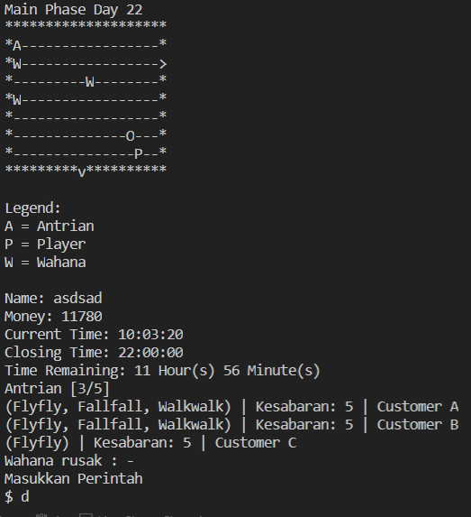

# Park


> Theme park simulation implemented with various ADT in C

|Made by|
| ---|
|Rexy Gamaliel R.  |
|Dionisius Darryl H.  |	
|James Chandra   |
|Jordan Daniel J.  |
|Gregorius Dimas B. |


## Table of contents
* [General info](#general-info)
* [Screenshots](#screenshots)
* [Technologies](#technologies)
* [Setup](#setup)

## General info
A theme park simulation game made with C, implementing various abstract data types (ADT)

## Screenshots


## Technologies
* C v.99

## Setup
1. Make sure that ```C``` is installed in your computer
2. Clone this repository in your local computer
3. Execute ```main.exe``` or type ```./main``` in your terminal
4. To compile the program, make sure that you're in the main directory and simply run the script inside ```./script/compile-script.txt```

## Thank you
